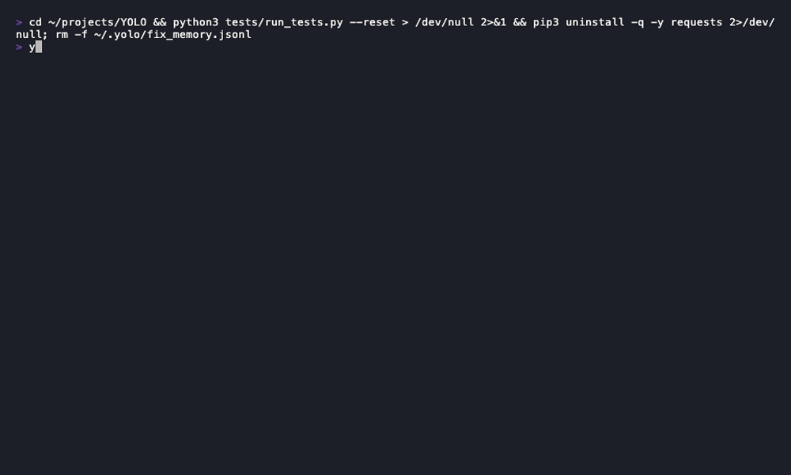
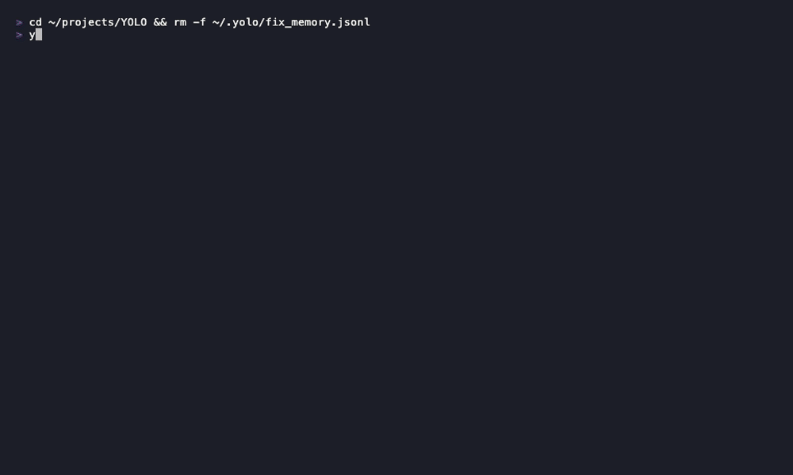
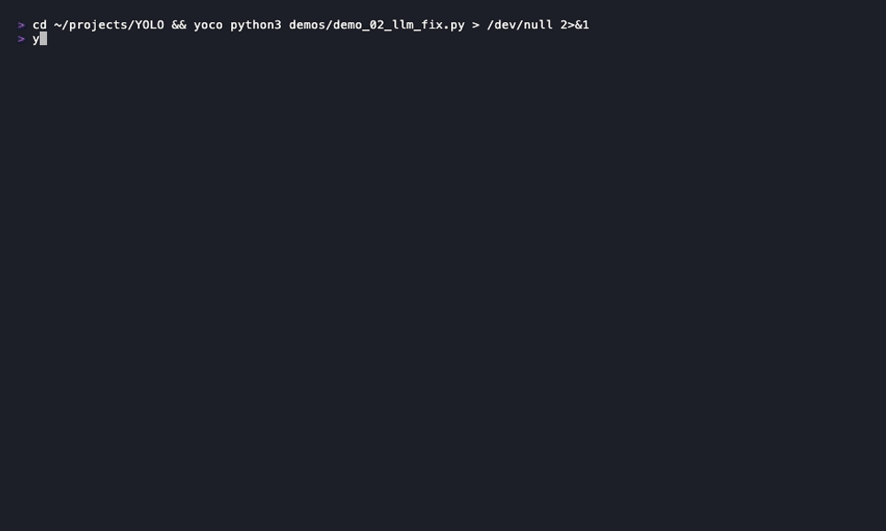
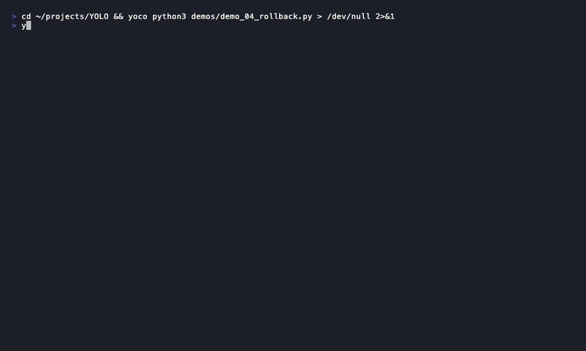
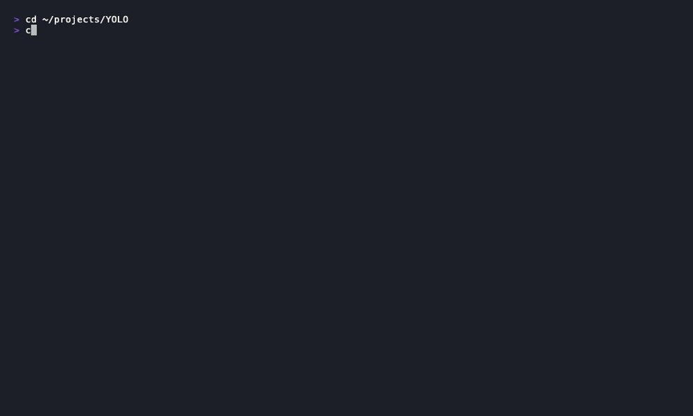
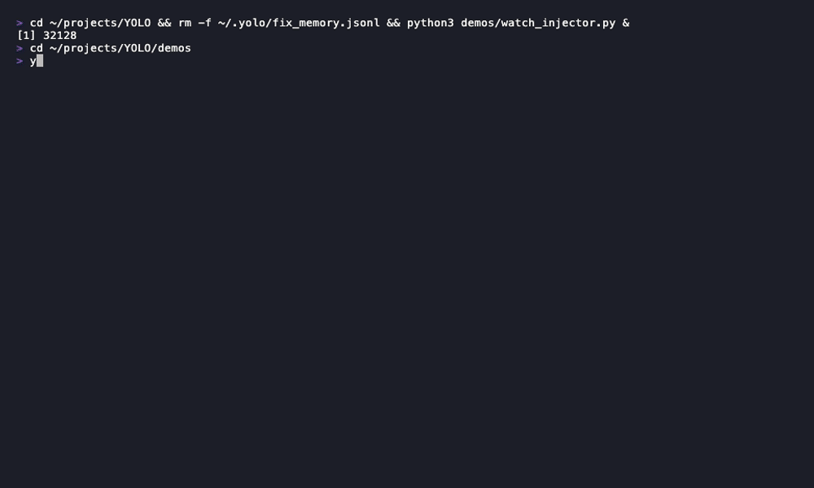
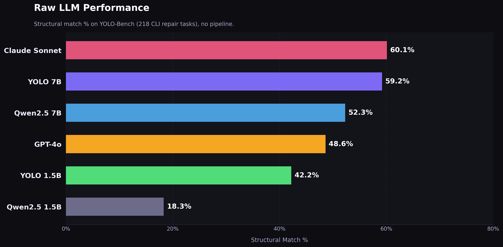
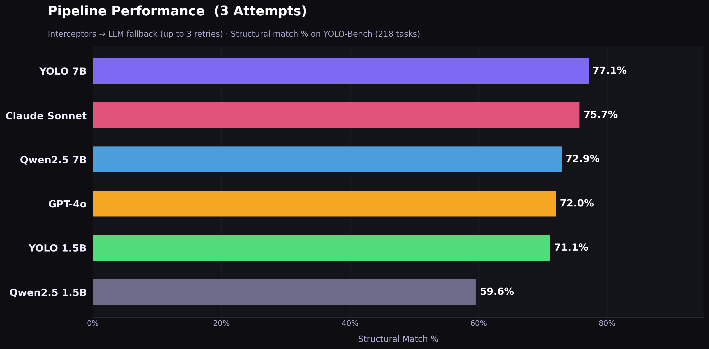

<p align="center">
  
</p>

<h1 align="center">YOLO — You Only Launch Once</h1>

<p align="center">
  <strong>An AI agent that fixes your broken CLI commands. Automatically. While you watch.</strong>
</p>

<p align="center">
  <a href="LICENSE"></a>
  <a href="https://python.org"></a>
  <a href="https://ollama.com"></a>
  
  
</p>

> [!CAUTION]
> **Disclaimer:** YOCO is experimental and can modify/delete files. Use it in isolated environments like Docker. See [DISCLAIMER.md](DISCLAIMER.md) for full details.

---

## The pitch

You run a command. It breaks. You stare at the error. You Google it. You copy-paste from Stack Overflow. It breaks again. You question your life choices.

**Or:** you run YOLO. It sees the error. It fixes it. It retries. You get coffee.

```bash
$ yoco python3 myapp.py
```

That's it. That's the whole interface.

---

## Demo

### Brain 1 — Interceptor: missing package fixed in under a second
<p align="center">
  
</p>

### Brain 3 — Local LLM: patches a logic bug in your code
<p align="center">
  
</p>

### Brain 2 — Fix Memory: same error, instant replay
<p align="center">
  
</p>

### Rollback: undo everything YOCO changed
<p align="center">
  
</p>

### Dry Run: preview the fix before applying it
<p align="center">
  
</p>

### Security Gate: blocks git push when an API key is exposed
<p align="center">
  
</p>

### Watch Mode: auto-fixes on every file save
<p align="center">
  
</p>

---

## What actually happens under the hood

YOLO has three brains, tried in order from fastest to slowest:

```
Error hits
    │
    ▼
┌─────────────────────────────────────────────────┐
│  Brain 1: Interceptors                          │  ← 73 deterministic rules
│  "ModuleNotFoundError: No module named 'flask'" │    fires in <1ms
│  → pip install flask                            │    no LLM involved
└─────────────────────────────────────────────────┘
    │ no match
    ▼
┌─────────────────────────────────────────────────┐
│  Brain 2: Fix Memory                            │  ← remembers past fixes
│  "seen this IndexError before (3x)"             │    fires in <5ms
│  → replay the fix that worked last time         │    no LLM involved
└─────────────────────────────────────────────────┘
    │ cache miss
    ▼
┌─────────────────────────────────────────────────┐
│  Brain 3: Local LLM                             │  ← fine-tuned Qwen2.5-Coder
│  reads your error + your code                   │    runs 100% locally
│  → generates a targeted fix command             │    ~1-3 seconds on Apple Silicon
└─────────────────────────────────────────────────┘
```

Fix works → snapshot it, remember it, move on.
Fix fails → roll back every file to its pre-YOLO state, try again.

---

## Benchmark

**218 real CLI errors. Same prompts. Same scoring. YOLO-Coder-8B beats GPT-4o — running 100% offline.**

| Model | Raw LLM | Pipeline×3 |
|---|---|---|
| **YOLO-Coder-8B** | 59.2% | **77.1%** |
| Claude Sonnet 4.6 | 60.1% | — |
| GPT-4o | 48.6% | — |
| YOLO-Coder-1.5B | 42.2% | 71.1% |

<p align="center">
  
</p>
<p align="center">
  
</p>

> Scoring: structural match (flag-order-independent, compound-command-aware). Dataset: [github.com/erdemozkan/YOLO-CODER/tree/main/benchmark](https://github.com/erdemozkan/YOLO-CODER/tree/main/benchmark)

---

## Install

### 1. Install YOCO

```bash
pip install yolo-coder
```

Or install from source:

```bash
git clone https://github.com/erdemozkan/YOLO-CODER
cd YOLO-CODER
pip install -e .
```

### 2. Install Ollama

Download from [ollama.com](https://ollama.com) or:

```bash
brew install ollama
ollama serve   # start the server (runs on http://localhost:11434)
```

### 3. Set up the AI model

**Option A — Pull directly from Hugging Face (easiest):**

```bash
# 1.5B model — fast, ~941MB, runs on any machine
ollama run hf.co/erdemozkan/YOLO-Coder-1.5B

# 8B model — smarter, ~4.4GB, needs ~6GB RAM
ollama run hf.co/erdemozkan/YOLO-Coder-8B
```

**Option B — Download GGUF manually and register:**

```bash
# Download the Q4 GGUF from HuggingFace
# → https://huggingface.co/erdemozkan/YOLO-Coder-8B/blob/main/YOLO-Coder-8B-Q4_K_M.gguf

# Create a Modelfile
cat > Modelfile <<'EOF'
FROM ./YOLO-Coder-8B-Q4_K_M.gguf

TEMPLATE """{{ if .System }}<|im_start|>system
{{ .System }}<|im_end|>
{{ end }}<|im_start|>user
{{ .Prompt }}<|im_end|>
<|im_start|>assistant
"""

PARAMETER stop "<|im_start|>"
PARAMETER stop "<|im_end|>"
PARAMETER temperature 0.1
PARAMETER top_p 0.1
SYSTEM """You are a CLI repair tool. Output ONLY a single bare bash command to fix the error. No explanation. No markdown. No backticks."""
EOF

# Register with Ollama
ollama create yolo-coder-8b -f Modelfile

# Verify it works
ollama run yolo-coder-8b "ModuleNotFoundError: No module named 'requests'"
# → pip install requests
```

### 4. Configure YOCO to use your model

```bash
mkdir -p ~/.yolo
# Use 8B (default, best accuracy):
echo '{"model": "hf.co/erdemozkan/YOLO-Coder-8B"}' > ~/.yolo/config.json

# Or use 1.5B (faster, low RAM):
echo '{"model": "hf.co/erdemozkan/YOLO-Coder-1.5B"}' > ~/.yolo/config.json
```

### 5. Run it

```bash
yoco python3 myapp.py
```

---

## Usage

```bash
# Basic: fix whatever breaks
yoco python3 myapp.py
yoco npm run dev
yoco cargo build
yoco docker-compose up

# See what it would do without doing it
yoco --dry-run python3 myapp.py

# Get a full AI explanation of what went wrong and why
yoco --explain python3 myapp.py

# Watch mode: re-run on every file save
yoco --watch python3 myapp.py

# Undo everything YOLO changed in the last session
yoco --rollback

# Undo a specific file
yoco --rollback src/main.py

# Browse history of past runs
yoco --history

# Use the bigger 8B model for hard errors
yoco --model hf.co/erdemozkan/YOLO-Coder-8B python3 myapp.py
```

---

## What it can fix right now

| Category | Examples |
|---|---|
| **Python** | `ModuleNotFoundError`, `SyntaxError`, `PermissionError`, `FileNotFoundError`, `IndexError`, `ZeroDivisionError`, `AttributeError`, `KeyError`, `TypeError` |
| **pip** | `DEPRECATION`, `--break-system-packages`, missing packages, hash mismatches |
| **Node.js** | `Cannot find module`, `MODULE_NOT_FOUND` |
| **npm** | `ENOENT`, `ERESOLVE` (peer deps), `EACCES` (permissions) |
| **TypeScript** | `TS2304` (cannot find name), `TS2339` (property does not exist) |
| **Docker** | Image not found, port already in use, container name collision, daemon not running |
| **Git** | Merge conflicts, detached HEAD, push rejected, nothing to commit, not a repo |
| **Everything else** | LLM fallback covers what the rules don't |

---

## The model

Fine-tuned `Qwen2.5-Coder` models trained on **6,719** real CLI error/fix pairs. Output: exactly one bare shell command. No markdown, no explanation, no backticks.

| Model | Size | RAM | HuggingFace |
|---|---|---|---|
| **YOLO-Coder-8B** | ~4.4GB | ~6GB | [erdemozkan/YOLO-Coder-8B](https://huggingface.co/erdemozkan/YOLO-Coder-8B) |
| YOLO-Coder-1.5B | ~941MB | ~2GB | [erdemozkan/YOLO-Coder-1.5B](https://huggingface.co/erdemozkan/YOLO-Coder-1.5B) |

### Using with Ollama
```bash
# 8B — best accuracy (default)
ollama run hf.co/erdemozkan/YOLO-Coder-8B

# 1.5B — fast, runs on any machine
ollama run hf.co/erdemozkan/YOLO-Coder-1.5B
```

### Using with LM Studio or llama.cpp
1. Open the HF repo linked above.
2. Download the `Q4_K_M.gguf` file from the Files tab.
3. Load into LM Studio or run with your `llama.cpp` server.

Training data: **6,719** error/fix pairs across 15 categories: Python, pip, Node.js, npm, TypeScript, Docker, Git, shell, Cargo/Rust, SSH, database, venv/conda, make/cmake, cloud (AWS/GCP), yarn. Fine-tuned with MLX LoRA on Apple Silicon.

---

## Rollback & history

YOLO snapshots every file it touches before making any changes. If a fix fails after 3 attempts, everything is restored automatically.

```bash
# See what YOLO changed in the last session
yoco --rollback
# → numbered list of modified files, pick one or press 'a' to undo all

# See the last 20 runs
yoco --history
# → table: date / command / outcome / source (interceptor / memory / LLM)

# See details of run #5
yoco --history 5
```

---

## Configuration

YOCO supports **Ollama**, **LM Studio**, and **llama.cpp** out of the box. Config is layered — CLI flags override the saved file, which overrides built-in defaults.

### Config file

```json
// ~/.yolo/config.json
{
  "provider": "ollama",
  "host": "localhost",
  "port": 11434,
  "model": "hf.co/erdemozkan/YOLO-Coder-8B",
  "max_attempts": 3,
  "dry_run": false
}
```

### Per-run CLI overrides

```bash
# Switch provider for one run
yoco --provider lmstudio python3 myapp.py

# Custom host or port (e.g. Ollama on a remote machine or non-default port)
yoco --host 192.168.1.50 --port 11434 python3 myapp.py

# Override model for one run
yoco --model hf.co/erdemozkan/YOLO-Coder-8B python3 myapp.py
```

### Provider defaults

| Provider | Default port | Notes |
|---|---|---|
| `ollama` | `11434` | `ollama serve` — recommended |
| `lmstudio` | `1234` | Enable "Local Server" in the LM Studio UI |
| `llamacpp` | `8080` | `./server -m model.gguf --port 8080` |

### Setting up each provider

**Ollama (recommended)**
```bash
ollama serve                                       # start the server
ollama run hf.co/erdemozkan/YOLO-Coder-8B         # pull + verify model
echo '{"provider": "ollama", "model": "hf.co/erdemozkan/YOLO-Coder-8B"}' > ~/.yolo/config.json
```

**LM Studio**
```bash
# 1. Open LM Studio → Model tab → load any GGUF model
# 2. Go to Local Server tab → Start Server (enable CORS)
# 3. Tell YOCO to use it:
echo '{"provider": "lmstudio"}' > ~/.yolo/config.json
# LM Studio uses whatever model is currently loaded — no model name needed
```

**llama.cpp server**
```bash
./server -m YOLO-Coder-8B-Q4_K_M.gguf --port 8080  # start the server
echo '{"provider": "llamacpp", "port": 8080}' > ~/.yolo/config.json
```

**Custom port or remote host**
```bash
# Ollama running on a non-default port
echo '{"provider": "ollama", "host": "localhost", "port": 12345}' > ~/.yolo/config.json

# Ollama on a remote machine on your local network
echo '{"provider": "ollama", "host": "192.168.1.50", "port": 11434}' > ~/.yolo/config.json
```

### Check active config

```bash
yoco --config
```

---

## Philosophy

Most AI coding tools want to be your pair programmer. YOLO wants to be the intern who quietly fixes the thing that was blocking you so you can keep doing what you were doing.

It runs locally. It doesn't read your whole codebase. It doesn't require an API key. It doesn't post your stack traces to anyone. It doesn't ask for confirmation for the obvious stuff. It just fixes it.

The design priorities, in order:

1. **Speed** — interceptors fire before the LLM even wakes up
2. **Safety** — nothing is applied without a snapshot; everything is reversible
3. **Locality** — 100% local inference, no data leaves your machine
4. **Simplicity** — one command, wraps whatever you were already running

Oh, and while it works, it'll throw out a random quip — "YOLOing..", "Crying..", "Day dreaming.." — just for fun 😄

---

## Roadmap

See [FUTURE_FEATURES.md](FUTURE_FEATURES.md) for deferred ideas with architectural reasoning.

Completed:
- [x] `--explain` mode — plain-English diff after every fix
- [x] `--watch` mode — re-runs on every file save
- [x] `--rollback` — interactive undo picker
- [x] `--dry-run` — preview fix without applying
- [x] Fix memory — instant replay of past fixes
- [x] Security gate — blocks git push when secrets are detected
- [x] First-run disclaimer with local acceptance record
- [x] `pip install yolo-coder` — published to PyPI

Near-term:
- [ ] VS Code extension (show fix inline before applying)
- [ ] CI mode (non-interactive, exits 0 on fix, 1 on failure)
- [ ] Lean terminal UI — interactive dashboard while YOCO works
- [ ] YOCO Web — browser-based interface similar to Claude Code

---

## Contributing

Interceptors are the easiest entry point. Add a function to `core/interceptors.py`, append it to the `INTERCEPTORS` list, add a test case to `tests/tests.json`. See [CLAUDE.md](CLAUDE.md) for the full developer guide.

---

## License

MIT. Do whatever you want with it. If you make a million dollars, consider buying the author a coffee.

---

<div align="center">

**Star it if it saved you from a Stack Overflow rabbit hole.**

*Built on Apple Silicon. Powered by local LLMs. Runs at YOLO speed.*

</div>
