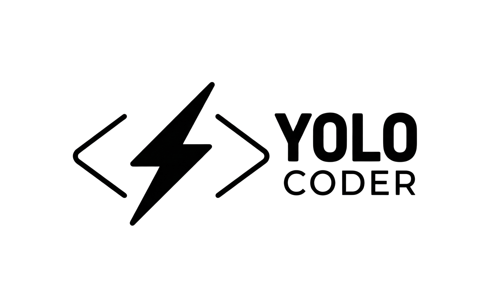

<p align="center">
  
</p>

<h1 align="center">YOLO — You Only Launch Once</h1>

<p align="center">
  <strong>An AI agent that fixes your broken CLI commands. Automatically. While you watch.</strong>
</p>

<p align="center">
  <a href="LICENSE"></a>
  <a href="https://python.org"></a>
  <a href="https://ollama.ai"></a>
  
  
</p>

---

## The pitch

You run a command. It breaks. You stare at the error. You Google it. You copy-paste from Stack Overflow. It breaks again. You question your life choices.

**Or:** you run YOLO. It sees the error. It fixes it. It retries. You get coffee.

```bash
$ yoco python3 myapp.py
```

That's it. That's the whole interface.

---

## Demo

> *Recording coming soon — see [demos/](demos/) for the scripts*

---

## What actually happens under the hood

YOLO has three brains, tried in order from fastest to slowest:

```
Error hits
    │
    ▼
┌─────────────────────────────────────────────────┐
│  Brain 1: Interceptors                          │  ← 23 regex rules
│  "ModuleNotFoundError: No module named 'flask'" │    fires in <1ms
│  → pip install flask                            │    no LLM involved
└─────────────────────────────────────────────────┘
    │ no match
    ▼
┌─────────────────────────────────────────────────┐
│  Brain 2: Fix Memory                            │  ← remembers past fixes
│  "seen this IndexError before (3x)"             │    fires in <5ms
│  → replay the fix that worked last time         │    no LLM involved
└─────────────────────────────────────────────────┘
    │ cache miss
    ▼
┌─────────────────────────────────────────────────┐
│  Brain 3: Local LLM                             │  ← fine-tuned Qwen2.5-Coder
│  reads your error + your code                   │    runs 100% locally
│  → generates a targeted fix command             │    ~1-3 seconds on Apple Silicon
└─────────────────────────────────────────────────┘
```

Fix works → snapshot it, remember it, move on.
Fix fails → roll back every file to its pre-YOLO state, try again.

---

## Install

### 1. Clone and install YOCO

```bash
git clone https://github.com/erdemozkan/YOLO-CODER
cd YOLO-CODER
pip install -e .
```

### 2. Install Ollama

Download from [ollama.ai](https://ollama.ai) or:

```bash
brew install ollama
ollama serve   # start the server (runs on http://localhost:11434)
```

### 3. Set up the AI model

**Option A — Pull directly from Hugging Face (easiest):**

```bash
# 1.5B model — fast, ~941MB, runs on any machine
ollama run hf.co/erdemozkan/YOLO-1.5B-Qwen-Coder

# 7B model — smarter, ~4.4GB, needs ~6GB RAM
ollama run hf.co/erdemozkan/YOLO-7B-Qwen-Coder
```

**Option B — Download GGUF manually and register:**

```bash
# Download the Q4 GGUF from HuggingFace
# → https://huggingface.co/erdemozkan/YOLO-7B-Qwen-Coder/blob/main/YOLO-7B-Qwen-q4.gguf

# Create a Modelfile
cat > Modelfile <<'EOF'
FROM ./YOLO-7B-Qwen-q4.gguf

TEMPLATE """{{ if .System }}<|im_start|>system
{{ .System }}<|im_end|>
{{ end }}<|im_start|>user
{{ .Prompt }}<|im_end|>
<|im_start|>assistant
"""

PARAMETER stop "<|im_start|>"
PARAMETER stop "<|im_end|>"
PARAMETER temperature 0.1
PARAMETER top_p 0.1
SYSTEM """You are a CLI repair tool. Output ONLY a single bare bash command to fix the error. No explanation. No markdown. No backticks."""
EOF

# Register with Ollama
ollama create yolo-7b -f Modelfile

# Verify it works
ollama run yolo-7b "ModuleNotFoundError: No module named 'requests'"
# → pip install requests
```

### 4. Configure YOCO to use your model

```bash
mkdir -p ~/.yolo
# Use 1.5B (default, fast):
echo '{"model": "hf.co/erdemozkan/YOLO-1.5B-Qwen-Coder"}' > ~/.yolo/config.json

# Or use 7B (if registered manually as above):
echo '{"model": "yolo-7b"}' > ~/.yolo/config.json
```

### 5. Run it

```bash
yoco python3 myapp.py
```

---

## Usage

```bash
# Basic: fix whatever breaks
yoco python3 myapp.py
yoco npm run dev
yoco cargo build
yoco docker-compose up

# See what it would do without doing it
yoco --dry-run python3 myapp.py

# Get a full AI explanation of what went wrong and why
yoco --explain python3 myapp.py

# Watch mode: re-run on every file save
yoco --watch python3 myapp.py

# Undo everything YOLO changed in the last session
yoco --rollback

# Undo a specific file
yoco --rollback src/main.py

# Browse history of past runs
yoco --history

# Use the bigger 7B model for hard errors
yoco --model yolo-7b python3 myapp.py
```

---

## What it can fix right now

| Category | Examples |
|---|---|
| **Python** | `ModuleNotFoundError`, `SyntaxError`, `PermissionError`, `FileNotFoundError`, `IndexError`, `ZeroDivisionError`, `AttributeError`, `KeyError`, `TypeError` |
| **pip** | `DEPRECATION`, `--break-system-packages`, missing packages, hash mismatches |
| **Node.js** | `Cannot find module`, `MODULE_NOT_FOUND` |
| **npm** | `ENOENT`, `ERESOLVE` (peer deps), `EACCES` (permissions) |
| **TypeScript** | `TS2304` (cannot find name), `TS2339` (property does not exist) |
| **Docker** | Image not found, port already in use, container name collision, daemon not running |
| **Git** | Merge conflicts, detached HEAD, push rejected, nothing to commit, not a repo |
| **Everything else** | LLM fallback covers what the rules don't |

---

## The model

YOLO ships with fine-tuned `Qwen2.5-Coder` models trained specifically on CLI error/fix pairs. It's trained to output exactly one bare shell command — no markdown, no explanation, no backticks. Just the fix.

**Our fine-tuned models are live on Hugging Face!**

### 1. Using with Ollama
You can pull and run the models directly via Ollama:
```bash
# For fast fixes, common errors, and low RAM usage:
ollama run hf.co/erdemozkan/YOLO-1.5B-Qwen-Coder

# For complex errors and better reasoning:
ollama run hf.co/erdemozkan/YOLO-7B-Qwen-Coder
```

### 2. Using with LM Studio or llama.cpp
1. Browse to my Hugging Face profile: [erdemozkan](https://huggingface.co/erdemozkan).
2. Open the model repository (`YOLO-1.5B-Qwen-Coder` or `YOLO-7B-Qwen-Coder`).
3. Download the `.gguf` file from the "Files" section.
4. Load the file into LM Studio or run it with your `llama.cpp` server.

| Model | Size | Best for |
|---|---|---|
| `YOLO-1.5B-Qwen-Coder` | 1.5B | Fast fixes, common errors, low RAM |
| `YOLO-7B-Qwen-Coder` | 7B | Complex errors, better reasoning |
| `qwen2.5-coder:7b` | 7B | Vanilla base model |

Training data: 2,250 error/fix pairs covering Python, Node, npm, TypeScript, Docker, Git, web frameworks, auth, async, CORS, circular imports, and more. Format: ChatML LoRA on Apple Silicon M-series.

---

## Rollback & history

YOLO snapshots every file it touches before making any changes. If a fix fails after 3 attempts, everything is restored automatically.

```bash
# See what YOLO changed in the last session
yoco --rollback
# → numbered list of modified files, pick one or press 'a' to undo all

# See the last 20 runs
yoco --history
# → table: date / command / outcome / source (interceptor / memory / LLM)

# See details of run #5
yoco --history 5
```

---

## Configuration

```json
// ~/.yolo/config.json
{
  "model": "yolo-coder",
  "endpoint": "http://localhost:11434/v1",
  "max_attempts": 3,
  "dry_run": false
}
```

---

## Philosophy

Most AI coding tools want to be your pair programmer. YOLO wants to be the intern who quietly fixes the thing that was blocking you so you can keep doing what you were doing.

It runs locally. It doesn't read your whole codebase. It doesn't require an API key. It doesn't post your stack traces to anyone. It doesn't ask for confirmation for the obvious stuff. It just fixes it.

The design priorities, in order:

1. **Speed** — interceptors fire before the LLM even wakes up
2. **Safety** — nothing is applied without a snapshot; everything is reversible
3. **Locality** — 100% local inference, no data leaves your machine
4. **Simplicity** — one command, wraps whatever you were already running

---

## Roadmap

See [FUTURE_FEATURES.md](FUTURE_FEATURES.md) for deferred ideas with architectural reasoning.

Near-term:
- [ ] Rust / cargo error interceptors
- [ ] Shell script error interceptors (bash -e failures)
- [ ] VS Code extension (show fix inline before applying)
- [ ] `--explain` deep-dive improvements
- [ ] CI mode (non-interactive, exits 0 on fix, 1 on failure)

---

## Contributing

Interceptors are the easiest entry point. Add a function to `core/interceptors.py`, append it to the `INTERCEPTORS` list, add a test case to `tests/tests.json`. See [CLAUDE.md](CLAUDE.md) for the full developer guide.

---

## License

MIT. Do whatever you want with it. If you make a million dollars, consider buying the author a coffee.

---

<div align="center">

**Star it if it saved you from a Stack Overflow rabbit hole.**

*Built on Apple Silicon. Powered by local LLMs. Runs at YOLO speed.*

</div>
